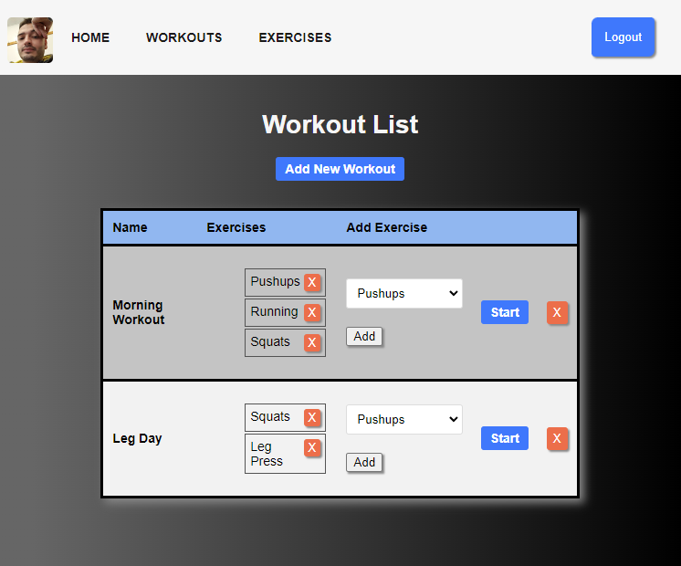

# Workout Tracking App

## Description

This Workout Tracking App is a web-based application that allows users to track their workout routines and progress. It provides a user-friendly interface for creating and managing workouts, recording exercise details, and viewing workout history. This app can help you stay organized and motivated.

## Getting Started

Users can log in on the Home page and see their workout history. 
Users can navigate between exercise and workout indexes where they can create their own exercises to add them to an existing or new workout.
In the Workouts index, users can start a workout to log their progress, which is accessed on the Home page.

- **Deployed App**: [Workout Tracking App](https://ev-workouts.fly.dev/)
- **Trello Board**: [Project Planning on Trello](https://trello.com/b/Rv5CQ33K/workout-tracker)

## Attributions

This project uses the following external resources:

- [MongoDB University](https://university.mongodb.com/): Free MongoDB Courses
- [Node.js](https://nodejs.org/en/docs/guides): Node.js documentation and guides.
- [YouTube - Ben Manley](https://www.youtube.com/@benmanley6070): Ben Manley's YouTube Channel
- [W3 Schools](https://www.w3schools.com/): W3 Schools tutorials
- [MDN Web Docs](https://developer.mozilla.org/en-US/): MDN Web Docs 

## Technologies Used

- **Front-end**:
  
  
  
- **Back-end**:
  
  
  
  
  
  
  
  
  
  
  
- **Version Control**:
  
  

## Next Steps

Planned future enhancements for the app (icebox items):

- Add a feature to calculate and display workout statistics and progress graphs.
- Enable sharing workout routines with friends or trainers.
- Develop a mobile app version for on-the-go tracking.

